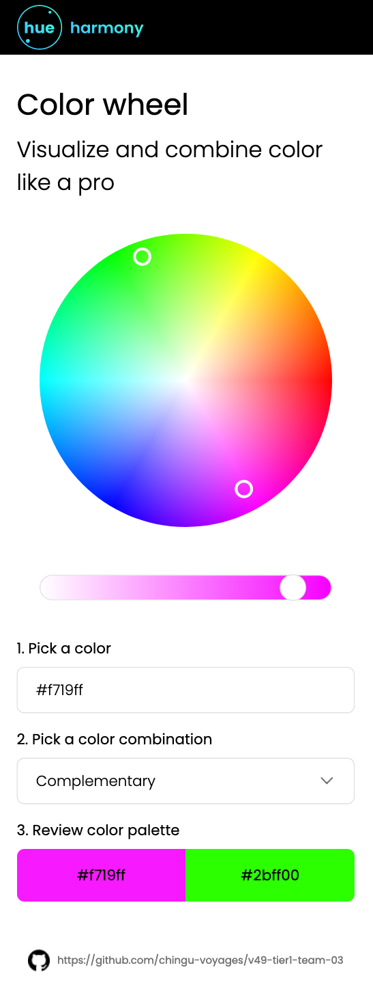
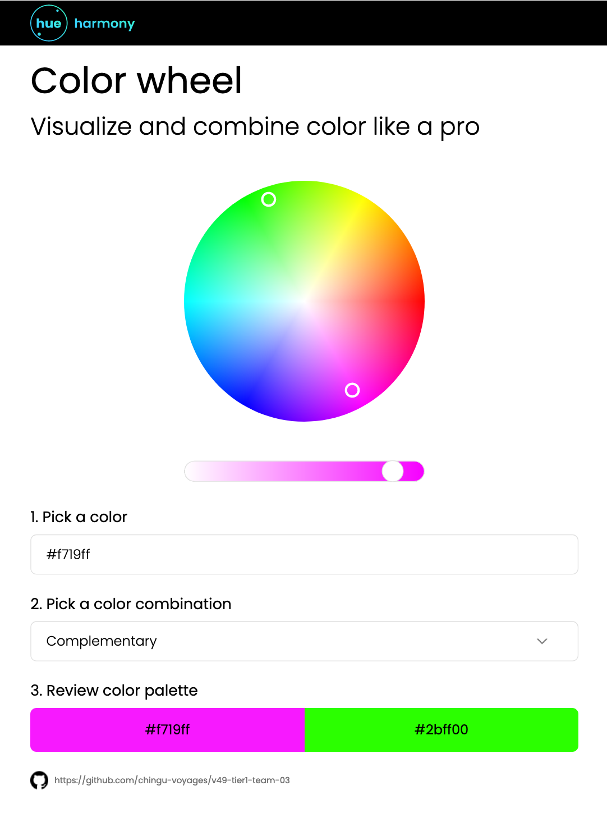
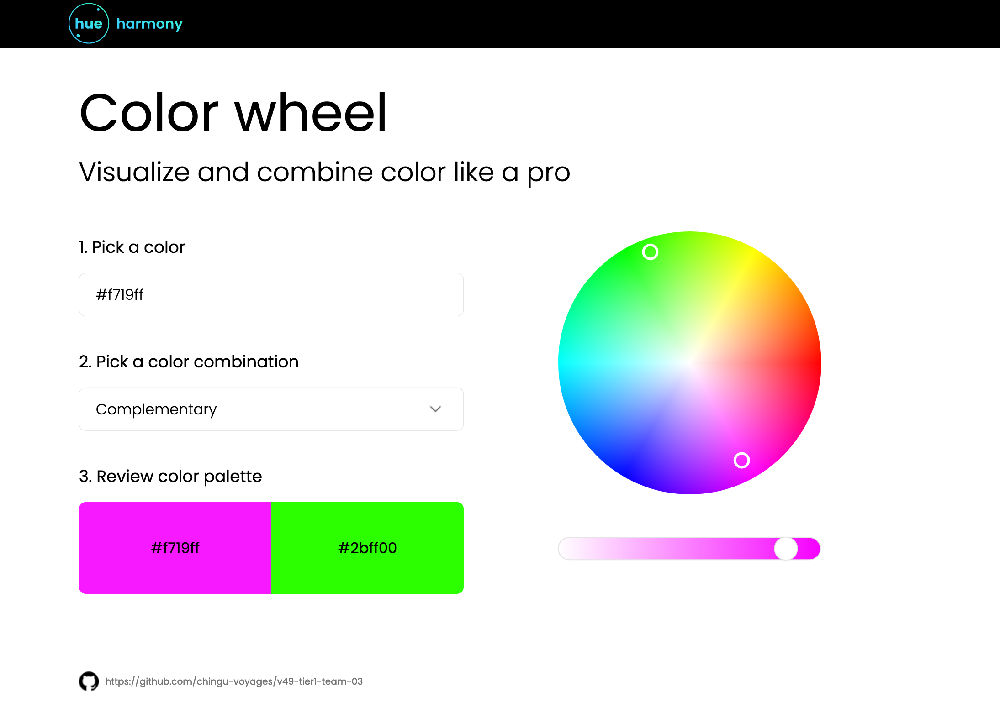

# Hue Harmony

## Overview

Hue harmony is a single page application (SPA) that allows users to get color palette suggestion based on a base color and color harmony. Hue Harmony leverages the power of AI to provide color palette suggestion for the user.

Live link is [here](https://chingu-voyages.github.io/v49-tier1-team-03/).

## Built With

- HTML
- CSS
- Javascript
- Groq AI API using llama3-70b-8192 model
- Figma

### Design

This webpage is responsive and was built based on a "mobile-first" approach.

**Mobile view**

**Tablet view**

**Desktop view**

### Features

*Color Selection*: User can select their base color either via the color wheel picker or input the color hexcode into the input field.

*Color Harmony Selection*: User can then select their color harmony of choice via the drop down menu. 

*Color Palette Output*: After the selection is made, Hue Harmony will display color suggestion onto a color palette.

**Mobile/Tablet View Demo**

 

**Desktop View Demo**

## Limitations
Hue Harmony relies on connection to Groq AI API so if the API is down or became deprecated, this webapp will not work and colour suggestion will not be displayed. 

Other than that, the quality of the color suggestion relies on the output from llama3-70b-8192 model via connection to Groq AI API. With the current limitation on AI generation, the color suggestion may be inaccurate.

## Our Team

- Ikechukwu Ezeji (Product Owner): [GitHub](https://github.com/Ikeze) / [LinkedIn](https://linkedin.com/in/ikechukwuezeji/)
- Jennifer Joynt (Scrum Master): [GitHub](https://github.com/jenj1976) / [LinkedIn](https://www.linkedin.com/in/jennifer-joynt-06a8581a)
- Anita Boakye-Yiadom (Scrum Master): [GitHub](https://github.com/AnitaBoakye) / [LinkedIn](https://linkedin.com/in/anitaboakyeyiadom/)
- Liat Cohen (UI/UX Designer): [GitHub](https://github.com/LiatPoschCohen) / [LinkedIn](https://linkedin.com/in/liatposchcohen)
- Michelle Lim (Developer): [GitHub](https://github.com/flora8heart) / [LinkedIn](https://linkedin.com/in/michelleknlim)
- Diego Raffa (Developer): [GitHub](https://github.com/Diegoireland1975) / [LinkedIn](https://www.linkedin.com/in/diego-raffa/)
- Dusan Djergovic (Developer): [GitHub](https://github.com/dusandjergovic) / [LinkedIn](https://www.linkedin.com/in/du%C5%A1an-%C4%91ergovi%C4%87-aaa2a4259/)
